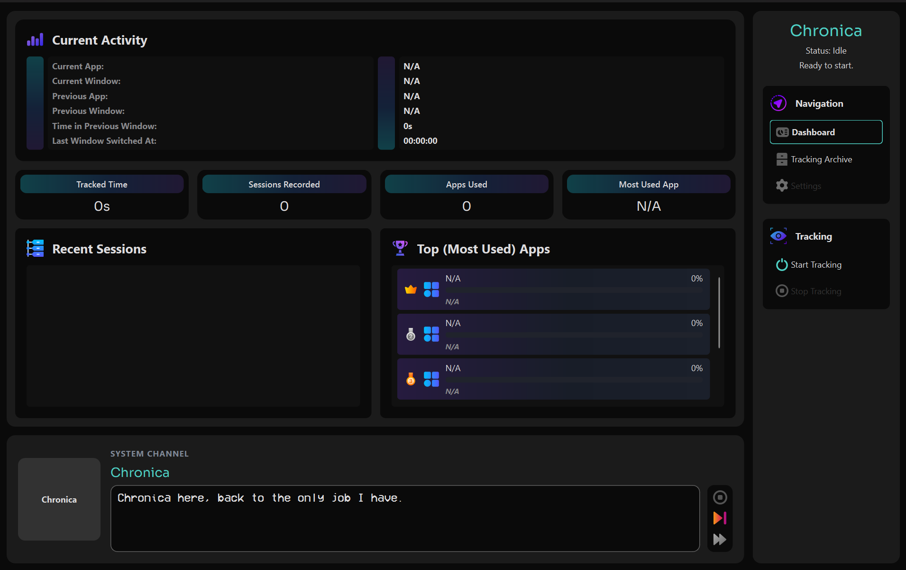
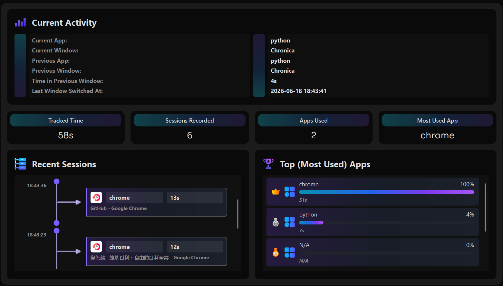
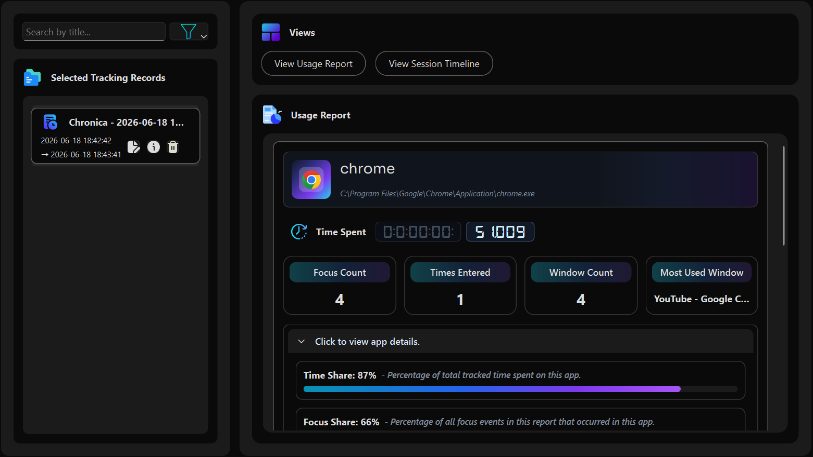

# Chronica

Chronica is a local Windows activity tracker that turns application and window usage into readable timelines, usage reports, and behavioral insights.

Instead of only showing how long an application remained open, Chronica focuses on how attention moves over time—when a window receives focus, how often the user returns to an application, and how long each continuous activity lasts.

Chronica also features a virtual companion with contextual dialogue. She observes the user's activity patterns with a slightly smug sense of humor, while still acting as a supportive presence throughout the tracking experience.

> **Status:** Initial public release  
> **Platform:** Windows  
> **Built with:** Python and PySide6

---

## Download

**Please Notice!!** Chronica is currently available as source code only.

A packaged Windows release is planned for a future version.

---

## Preview

### Overview

### Dashboard

### Usage Report

---

## Features

### Activity Tracking

- Presents easy-to-understand statistics for activities recorded during the current tracking session
- Records focus changes and continuous activity sessions
- Distinguishes between window-level sessions and app-level entries
- Displays dates and times according to the user's local time zone
- Generates a detailed usage report after each tracking session ends
- Displays all tracked activities in one tracking cycle as chronological timeline in tracking archive view (unfinished)

### Character Dialogue System

- Supports multi-line contextual dialogue
- Reacts to events such as booting, starting tracking, and stopping tracking
- Includes time-sensitive dialogue for early mornings and late nights

---

## How Chronica Interprets Activity

Chronica organizes tracked activity around several related concepts.

### Session

A session is a continuous period during which a specific window remains focused.

A new session begins whenever the active window changes. This includes switching to another window within the same application.

For example, if a window with the same title appears in 20 separate sessions, Chronica treats that as 20 separate times the window received focus.

### Focus Count

Focus count is the number of sessions associated with an application or window.

Because each session represents one continuous period of focus, an application may accumulate multiple focus counts through window switches, including switches between windows belonging to the same application.

### App Entry

An app entry begins when the user switches from another application into an app.

Unlike sessions, switching between windows within the same application does not create a new app entry. Consecutive sessions within the same application are merged into one app entry until the user moves to another application.

### Time Share

The percentage of all recorded usage time spent on a specific application or window.

### Focus Share

The percentage of all sessions associated with a specific application or window.

### Entry Share

The percentage of all app entries associated with a specific application.

Together, these metrics describe both how long an application or window was used and how frequently the user's attention returned to it.

---

## Privacy

Chronica is designed as a local desktop application.

Chronica may record:

- Active application names
- Executable paths
- Active window titles
- Focus timestamps
- Activity durations

Chronica does not record:

- Keystrokes
- Screenshots
- File contents
- Clipboard contents
- Passwords
- The contents of messages or documents

Activity records are stored locally on the user's device.

---

## Current Limitations

Chronica is still in an early public stage.

Current limitations may include:

- Some UI elements are disabled / greyed out or simply unfinished
- Windows-only support
- No packaged installer yet
- No automatic update system
- No cloud synchronization
- Limited report filtering and sorting
- Reduced performance when rendering very large reports
- Some interface wording and metric definitions may continue to evolve

---

## Roadmap

### Planned

- Complete Chronica's character design
- Improve performance for large usage reports
- Expand data export options
- Add more contextual dialogue and character interactions
- Refine application packaging and distribution
- Improve error handling and recovery
- Begin exploring a QML-based interface for richer visuals
- Add customizable tracking rules and more gamified interactions

### Exploring

- Expand Chronica with additional productivity tools, such as task management
- Add summaries for custom time periods
- Provide more detailed focus-pattern analysis
- Explore cross-platform support

The roadmap is exploratory and does not represent fixed release commitments.

---

## Why I Built Chronica

A few months ago, I was struggling to turn any of my ideas into a finished project.

My head was full of concepts, but most of them kept growing far beyond what one person could realistically handle. Eventually, I decided to put those larger ideas aside and start with something small—just a practice project I could actually finish.

While experimenting, I came across an API that could retrieve the currently active foreground window. That discovery gave me the idea of building a desktop activity tracker.

At first, I expected Chronica to remain a small project for sharpening my skills. But the more I worked on it, the more seriously I began to take it. I no longer wanted it to be just another utility that recorded numbers. I wanted to create something that could genuinely accompany people in their everyday lives.

That was when I gave the application a virtual soul named Chronica, who also became the namesake of the project.

Over time, my goal shifted toward creating a small but meaningful presence in people's daily routines. Through Chronica and the features planned for the future, I hope to give people a little more curiosity—and perhaps a little more motivation—to understand where their time goes.

---

## Technology

- Python
- PySide6
- Qt Widgets
- QSS

---

## License

License information will be added before the first public release.